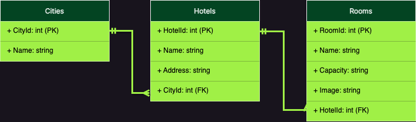

#  Boas-vindas ao repositório do projeto Hotel

## Sobre o projeto

Sua empresa do coração começou a desenvolver um software de booking de várias redes de hotéis.
Este projeto é uma API responsável pelo controle de cidades, hotéis e quartos disponíveis para realizar reservas.

### Habilidades Trabalhadas

- Entender do funcionamento do ASP.NET e como ele se integra ao C#.
- Entender do funcionamento do banco de dados.
- Criar operações de manipulação de banco de dados em uma API.

  
<strong>Clonando o Repositorio </strong>
 

  1. Clone o repositório

  - Use o comando: `git clone git@github.com:tryber/csharp-001-projeto-trybe-hotel.git`.
  - Entre na pasta do repositório que você acabou de clonar:
    - `cd csharp-001-projeto-trybe-hotel`

  2. Instale as dependências
  
  - Entre na pasta `src/`.
  - Execute o comando: `dotnet restore`.
  

   
<strong>Sobre o Projeto</strong>
 

Esta é uma API que será utilizada em uma aplicação de booking de várias redes de hotéis.
Exitem rotas das entidades acerca das cidades, hotéis e quartos que servirão para, no futuro, realizar o booking de pessoas clientes.

Esta disponibilizado o diagrama de entidade-relacionamento, alem de um container na qual você poderá utilizar um banco de dados.

O sistema está dividido em diretórios específicos para auxiliar na organização e desenvolvimento do projeto.

- `Controllers/`: Este diretório armazena os arquivos com as lógicas dos controllers da aplicação. Os métodos a serem desenvolvidos estão prontos mas sem implementação alguma, o que você desenvolverá ao longo do projeto.
 

- `Models/`: Este diretório armazena os arquivos com as models do banco de dados. As models `City`, `Hotel` e `Room` serão as instruções para as tabelas `Cities`, `Hotels` e `Rooms`. Lembre-se, o nome da tabela não é dado pelo nome da model mas sim pelo nome do `DBSet<model>` presente no contexto.
 

- `DTO/`: Este diretório armazena as classes de DTO. Algumas rotas esperam as `responses` baseadas nestes DTOs. Você pode conferir isso pelo requisito do projeto e pelo retorno dos métodos dos `repositories`.
 

- `Repository/`: Este diretório armazena as lógicas que farão a interação com o banco de dados. Os métodos de cada requisito já estão criados e você deverá incluir a implementação de cada um desses métodos respeitando o retorno do DTO. Além disso, você terá o arquivo `TrybeHotelContext` com o contexto para a conexão com o banco de dados. Todos os `repository` e o `context` possuem interfaces que estão nesse diretório e fornecem o contrato para essas classes.
 

  
<strong>🎲 Banco de Dados</strong>

   

  Para o desenvolvimento, o time de produto disponibilizou um *Diagrama de Entidade-Relacionamento (DER)* para construir a modelagem do banco de dados. Com essa imagem você já consegue saber:
  - Como nomear suas tabelas e colunas;
  - Quais são os tipos de suas colunas;
  - Relações entre tabelas.

    

  O diagrama infere 03 tabelas:
  - ***Cities***: tabela que armazenará um conjunto de cidades nas quais os hotéis estão localizados.
  - ***Hotels***: tabela que armazenará os hotéis da nossa aplicação. Note que informamos o `CityId`, atributo que armazenará o id da cidade.
  - ***Rooms***: tabela que armazenará os quartos de cada hotel da nossa aplicação. Note que informamos o `HotelId`, atributo que armazenará o id do hotel.

  Acerca dos relacionamentos, pelo diagrama de entidade-relacionamento temos:
  - Uma cidade pode ter vários hotéis.
  - Um hotel pode ter vários quartos.

  ⚠️ **Você poderá criar migrations para visualizar o banco de dados**

